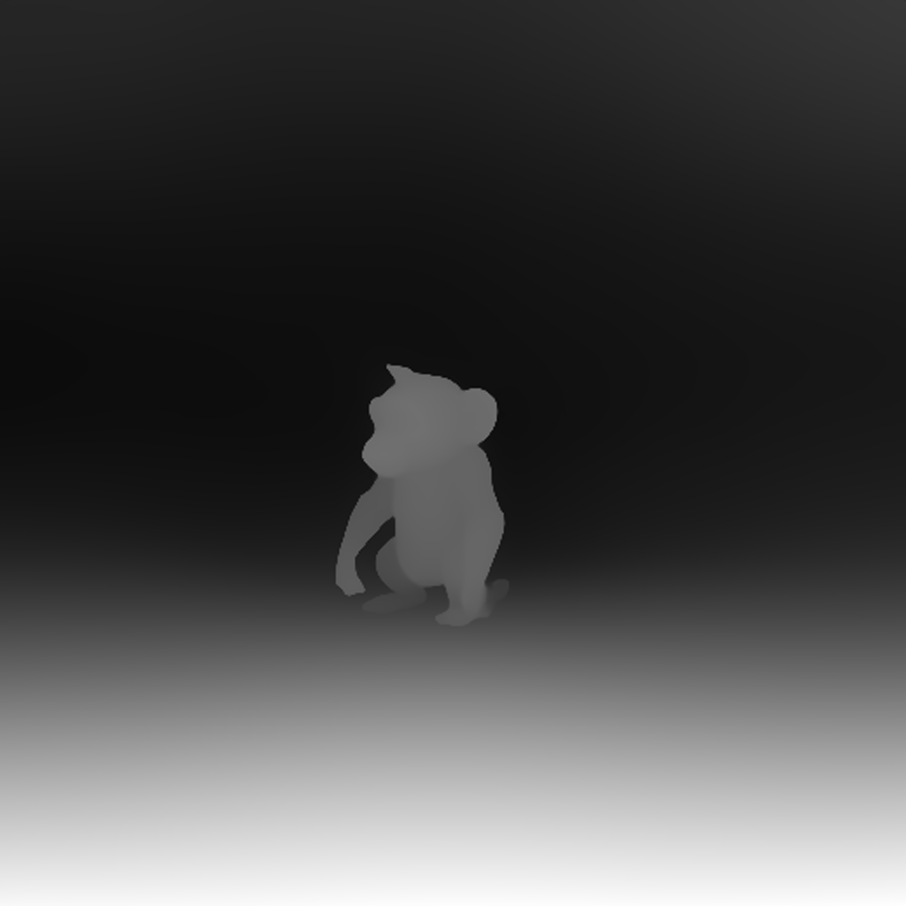

# Serve Diffuse

## Install

For a clean user enviroment, that is, pip package do not interfeer each other:

```bash
pip uninstall -y $(pip -v list | grep ${HOME}/.local | awk '{printf "%s ", $1}')
```

### Upgrade Python

```bash
sudo apt -y update && sudo apt -y install python3.11-full
python3.11 -m venv .venv
```

### Virtual Environment

```bash
python -m venv .venv
```

```bash
source .venv/bin/activate (on Windows: .venv\Scripts\activate)
```

```bash
pip install -r requirements.txt
```

### Notes

You may need to install diffusers from git directly, until some of the used pipelines will be added to the latest release.
Currently, FluxControlNetPipeline is not part of 0.30.3.

```bash
pip install git+https://github.com/huggingface/diffusers
```

Then check wheteher pytorch is working:

```bash
python try_torch.py
```

Under Linux or Windows, you should have CUDA available, if not, you can install it with:

Intall the CUDA Toolkit from <https://developer.nvidia.com/cuda-downloads>, then make sure you use the correct pytorch version.

```bash
>_: nvidia-smi
+---------------------------------------------------------------------------------------+
| NVIDIA-SMI 535.129.03             Driver Version: 535.129.03   CUDA Version: 12.2     |
|-----------------------------------------+----------------------+----------------------+
| GPU  Name                 Persistence-M | Bus-Id        Disp.A | Volatile Uncorr. ECC |
| Fan  Temp   Perf          Pwr:Usage/Cap |         Memory-Usage | GPU-Util  Compute M. |
|                                         |                      |               MIG M. |
|=========================================+======================+======================|
|   0  NVIDIA A10                     On  | 00000000:08:00.0 Off |                    0 |
|  0%   33C    P8              15W / 150W |      7MiB / 23028MiB |      0%      Default |
|                                         |                      |                  N/A |
+-----------------------------------------+----------------------+----------------------+
                                                                                         
+---------------------------------------------------------------------------------------+
| Processes:                                                                            |
|  GPU   GI   CI        PID   Type   Process name                            GPU Memory |
|        ID   ID                                                             Usage      |
|=======================================================================================|
|  No running processes found                                                           |
+---------------------------------------------------------------------------------------+
```

```bash
pip install torch torchvision torchaudio --index-url https://download.pytorch.org/whl/cu124
```

Now the above command should print something similar to:

```text
tensor([[0.6438, 0.9231, 0.1688],
        [0.6210, 0.3610, 0.2758],
        [0.3508, 0.3714, 0.0235],
        [0.7931, 0.8271, 0.8090],
        [0.5571, 0.2660, 0.3113]])
CUDA is available? True
```

## Examples

### Setup

Add an `.env` file with the `HF_TOKEN=<your hf token>` set.
Then execute:

```bash
./scripts/download_flux_weights
```

### Testing

```bash
python depth_renderer_main.py --image inputs/monkey.png --seed 42 --steps 24 --prompt "A monkey walking on the sea surface"
```




```bash
python depth_renderer_main.py --image inputs/monkey_true_depth.png --is_depth=True --seed 42 --steps 24 --prompt "A monkey walking on the sea surface" --depth_weight=0.45
```


```bash
python depth_renderer_main.py --image inputs/monkey_true_depth.png --is_depth=True --seed 42 --steps 24 --prompt "A monkey walking on the sea surface, old painting" --depth_weight=0.5
```


```bash
python depth_renderer_main.py --image inputs/monkey_true_depth.png --is_depth=True --seed 42 --steps 24 --prompt "A monkey walking on the sea surface, watercolor" --depth_weight=0.5
```


## Trubleshoting

### Apple Silicon

If you will receive aan error about being out of memory, you can try tweak PYTORCH_MPS_HIGH_WATERMARK_RATIO giving a value between 0.0 and 1.0. The lower the value, the more it will take, because it will use more swapping space on the disk to load the models.

```bash
>_ PYTORCH_MPS_HIGH_WATERMARK_RATIO=0.6 python3 sd3_controlnet_depth.py
```

## Run

The majority of the step necessary to test build and deploy the are explained here <https://replicate.com/docs/guides/push-a-model>

### Preqrequisites

These are the steps to install the required tools:

#### Cog

```bash
cd ..
sudo curl -o /usr/local/bin/cog -L https://github.com/replicate/cog/releases/latest/download/cog_`uname -s`_`uname -m`
sudo chmod +x /usr/local/bin/cog
cd serve-diffuse
```

After installing cog, you may have to install docker, and if on MacOS, make sure you have it accessible from the CLI.

Add the following line to your ~/.zshrc file:

```bash
export PATH="$PATH:/Applications/Docker.app/Contents/Resources/bin/"
```

#### Go

```bash
wget https://go.dev/dl/go1.23.1.linux-amd64.tar.gz
sudo tar -C /usr/local -xzf go1.23.1.linux-amd64.tar.gz
echo 'export PATH=$PATH:/usr/local/go/bin' >> ~/.bashrc
source ~/.bashrc
```

#### Replicate CLI

TODO: ...

### Test with Cog

Before buiding the cog image we want to download the weights. In order to do so, you need to have a `.env` file with and HF_TOKEN setup, which needs to have granted access to the `diffuse-diffusion/stable-diffusion-v3-base` model.

At this point you can run some of following commands locally to try the cog image is working:

```bash
sudo cog run scripts/download_sd3_weights
sudo cog predict -i prompt="monkey scuba diving"
sudo cog predict -i prompt="monkey on a desolated urban asphalt" -i base_image_url=@inputs/monkey.png
```

### Build

```bash
sudo cog build --separate-weights -t <your-model-name>
```

### Test with Docker

You can use docker images (need the docker deamon running):

```bash
# If your model uses a CPU:
sudo docker run -d -p 5001:5000 <your-model-name>

# If your model uses a GPU:
sudo docker run -d -p 5001:5000 --gpus all <your-model-name>

# If you're on an M1 Mac:
sudo docker run -d -p 5001:5000 --platform=linux/amd64 <your-model-name>
```

and then you can run the model with:

```bash
curl http://localhost:5001/predictions -X POST \
    --header "Content-Type: application/json" \
    --data '{"input": {"prompt": "a fury dragon" }}'
```

### Deploy

```bash
cog login
cog push r8.im/<replicate-username>/<your-model-name>
```
